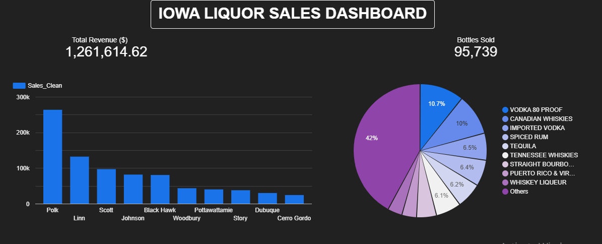

# 🥃 Iowa Liquor Sales Analysis

## 📌 Project Overview
Complete end-to-end data analysis project on Iowa Liquor Sales dataset
using SQL, Excel, and Google Looker Studio.

---

## 🛠️ Tools Used
| Tool | Purpose |
|------|---------|
| PostgreSQL | Data storage & querying |
| Excel | Data cleaning & analysis |
| Google Looker Studio | Interactive dashboard |

---

## 📊 Dataset
- **Source:** Iowa Liquor Sales (Public Dataset)
- **Records:** 10,000+ transactions
- **Fields:** Store, County, Category, Vendor, Sales, Volume

---

## 🔍 SQL Analysis
- Total revenue by county
- Top 10 stores by sales
- Best selling liquor categories
- Monthly sales trends
- Vendor performance analysis
- Average sale per transaction

---

## 📈 Excel Analysis
- Data cleaning & formatting
- Calculated columns — Revenue Per Bottle, Sale Category
- SUMIF, COUNTIFS, AVERAGEIF formulas
- Pivot Tables — Revenue by Month, Top Counties, Category Breakdown
- Charts & Conditional Formatting

---

## 📉 Google Looker Studio Dashboard
🔗 [Click Here to View Live Dashboard](https://datastudio.google.com/reporting/74fe262e-8588-4b53-a3d8-07eaaf87d9d3)

### Dashboard Features:
- ✅ KPI Scorecards
- ✅ County-wise Revenue Bar Chart
- ✅ Category Distribution Pie Chart
- ✅ Top Stores Performance Table
- ✅ Vendor Revenue Bar Chart
- ✅ Interactive Filters

---

## 💡 Key Insights
- **Polk County** has highest liquor sales in Iowa
- **Vodka 80 Proof** is most sold category (43.7%)
- **Hy-Vee** stores dominate top 10 rankings
- **Diageo** is top vendor by revenue

---

## 👤 Author
**Rahul**
- GitHub: Rahulthecode
